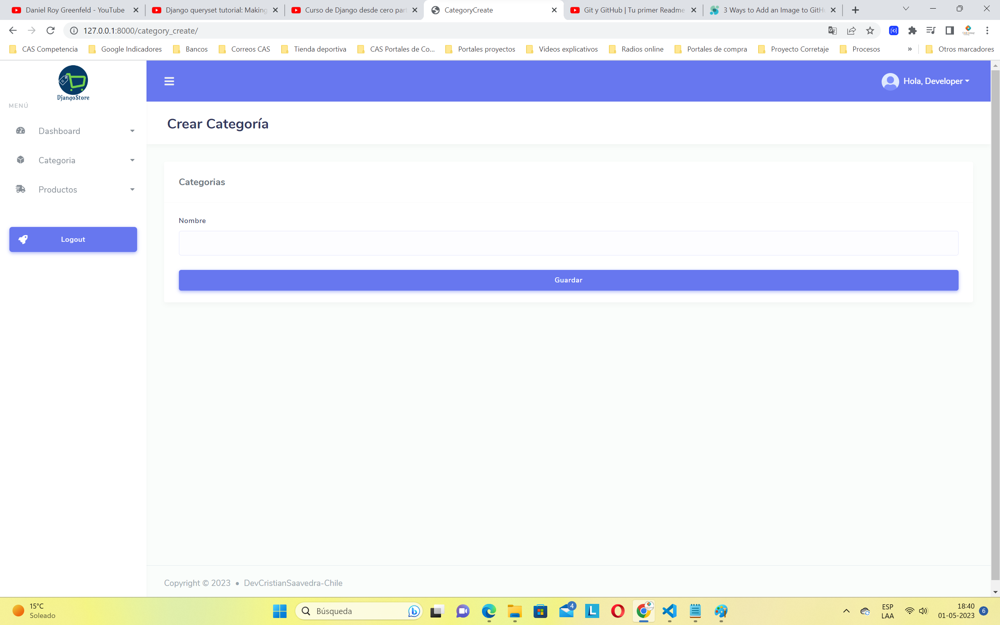
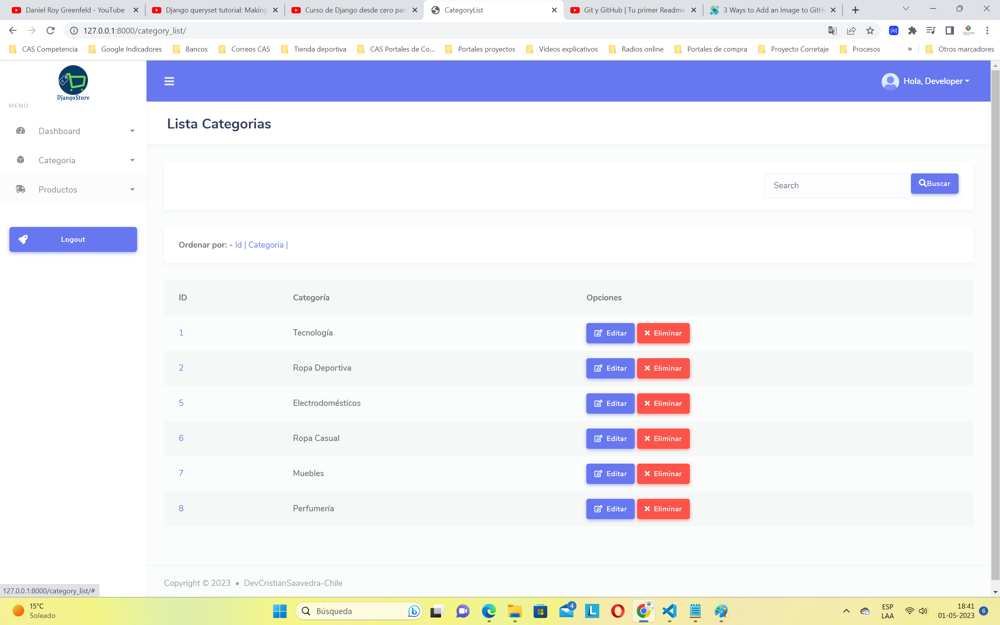
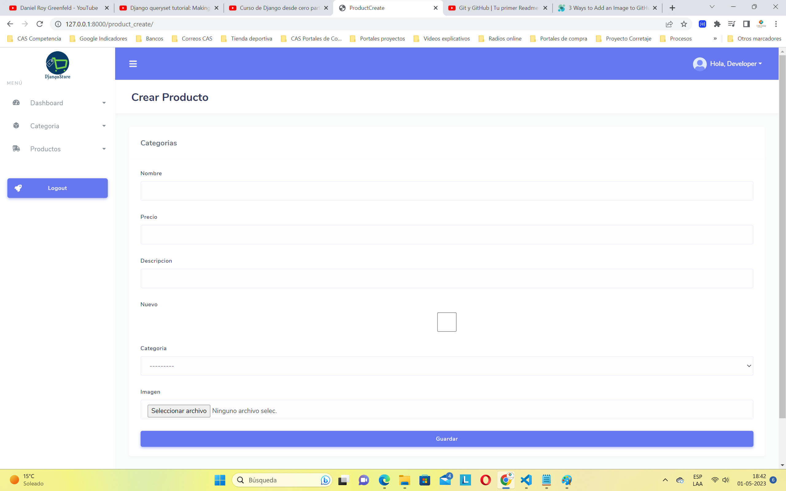
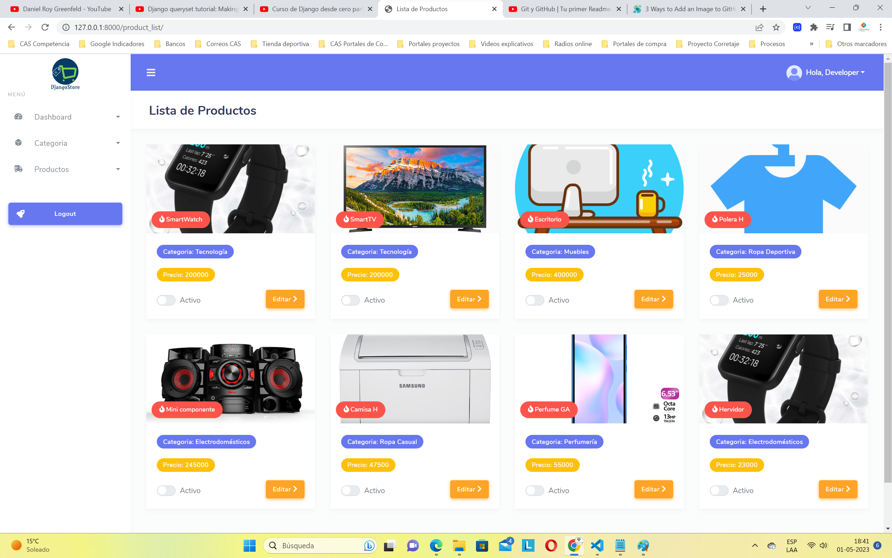
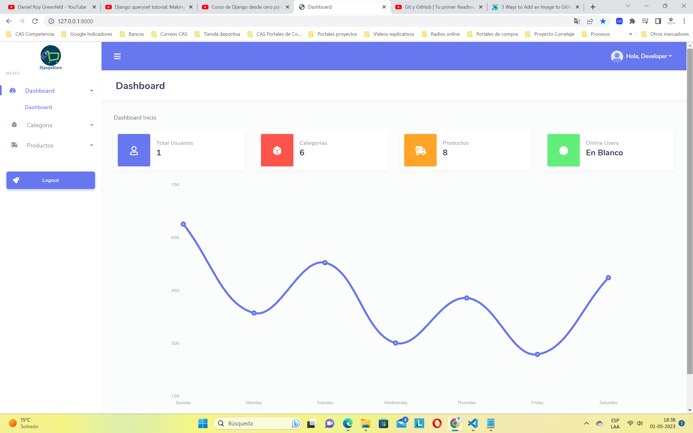
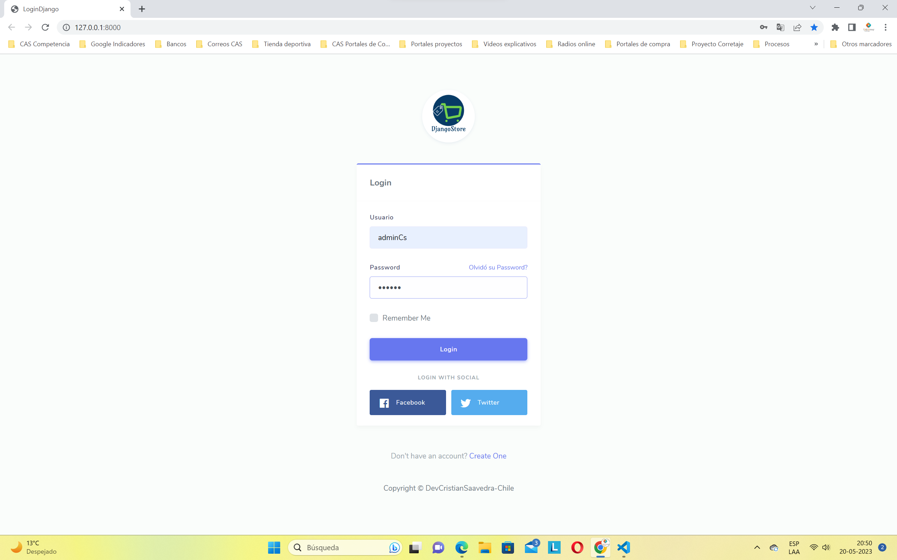
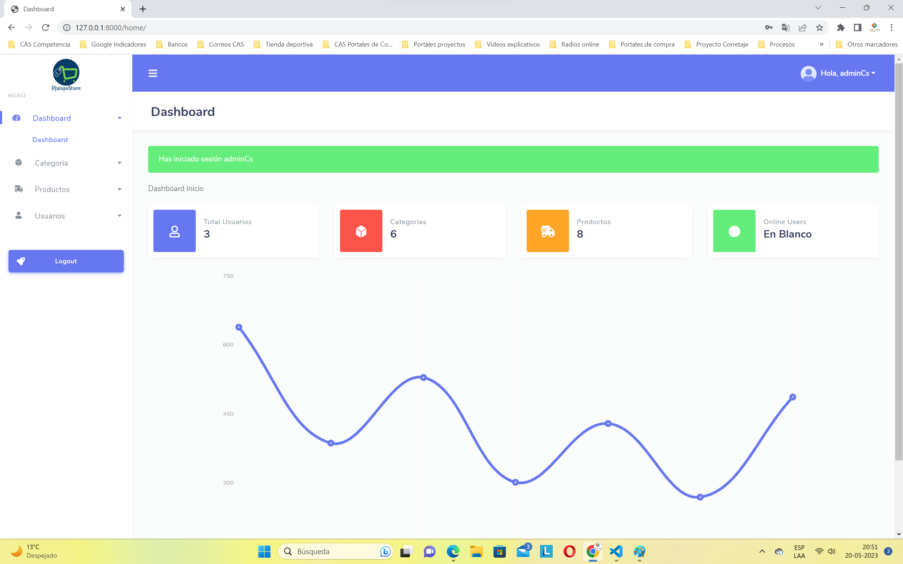
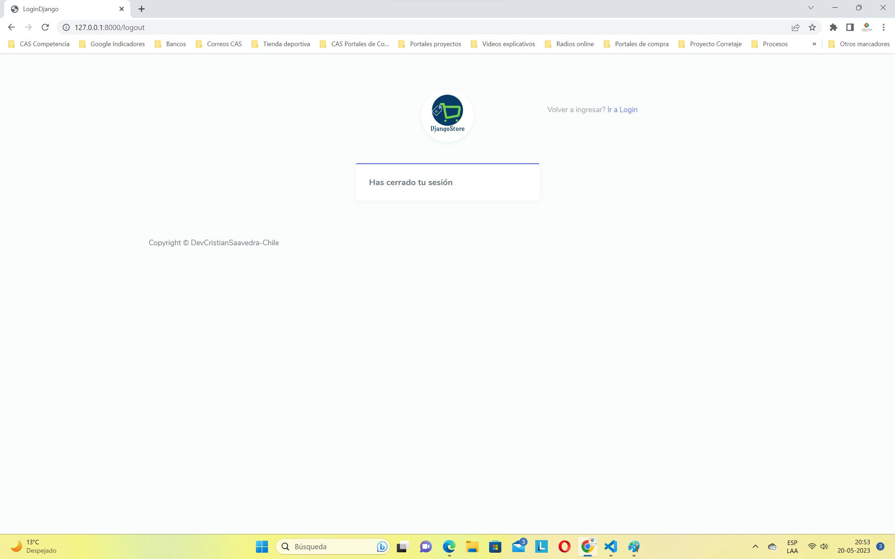
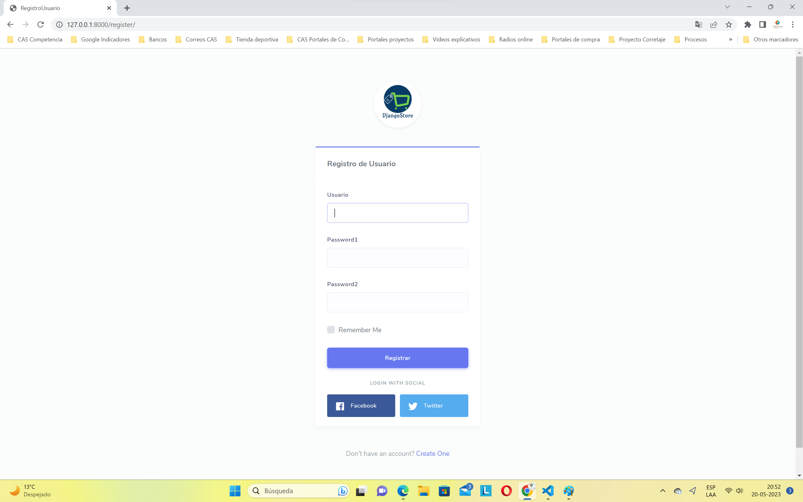

# DjangoTienda

## Sobre el proyecto

* Objetivo: El proyecto es una tienda por departamentos web, con exhibición de productos que pertenecen a distintas categorías.

## Funcionalidades

* Crear categoría: Formulario que permite crear categorías

* Ver lista de categorías: template que permite ver en formato tabla todas las categorías existentes. Incluye un buscador y la opción para editar o borrar categoría.

* Crear productos: Formulario para crear productos, enlazando a su categoría como foreingkey, con diversos atributos y una imagen.

* Ver productos: template que permite ver los productos en formato tarjeta. También se puede editar o borrar un producto.

* Dashboard: template que muestra la cantidad de usuarios, cantidad de categorías y productos. 

* Login: Formulario permite ingresar credenciales para hacer el login

* Bienvenida usuario logeado : Alerta en dashboard inicial da la bienvenida al usuario que ingresó desde el login.

* Logout : Template mostrado luego que el usuario hace clic desde el botón logout, sea en sidebar o bien desde el menú usuario, esquina superior derecha.

* Crear usuarios: Formulario permite crear usuarios

## Requerimientos

El repositorio incluye el archivo requirements.txt en donde se pueden ver los requerimientos.

## Para hacer funcionar

Sólo se debe iniciar el servidor con: python manage.py runserver
