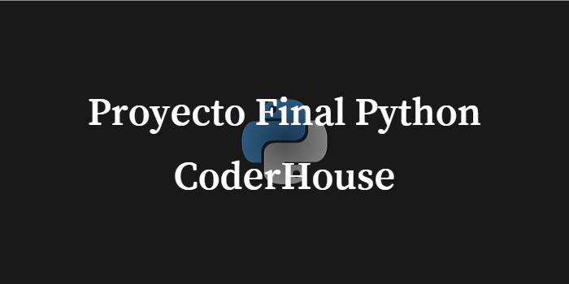
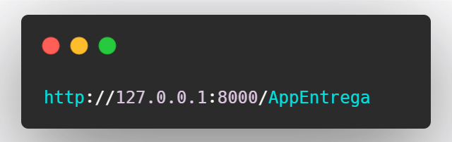
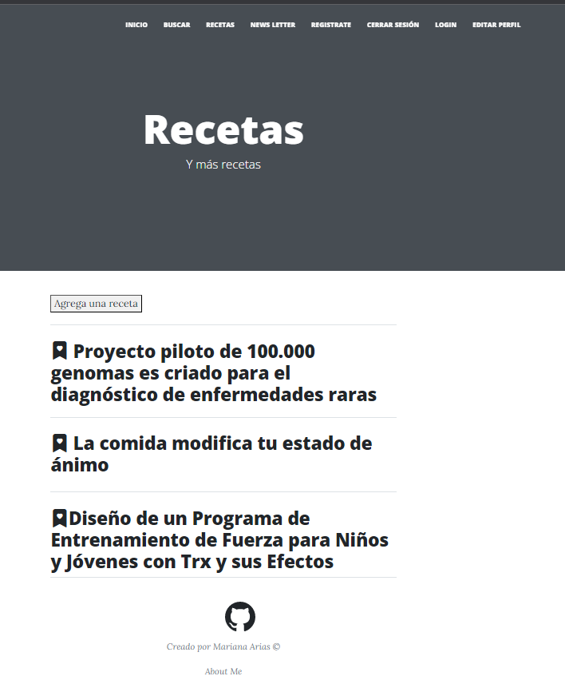

# Tercera-Pre-entrega

___

### Web de Django con CRUD. Utilizando herencias, y forms con metodo POST y GET.
 Link al video del proyecto 
 https://youtu.be/fv8fJd1lqys
____

## Instalación🔧


1.  Instalar Python


___2. Clona el repositorio___
```
https://github.com/marianariasj/Proyecto-Final-Python.git
```
3. Instalamos django
```
Pip intall django
```

# Ejecución del proyecto 📝


1. Corremos el proyecto

```
Python manage.py runserver
```

2. Una vez en el servidor, agregamos a la barra ___/AppEntrega___ Nos debe quedar algo así: 


____

# Proyecto 



